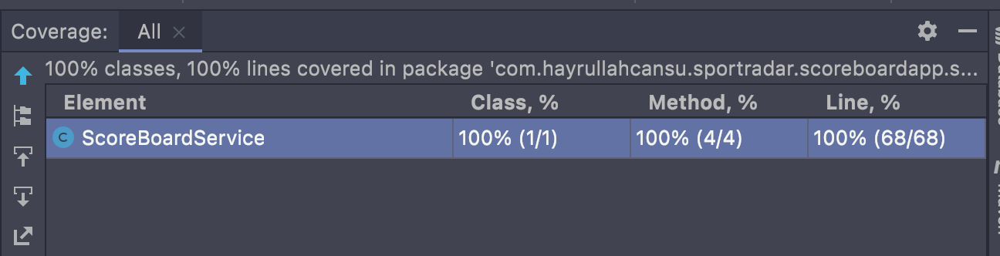

# Wallet Management

## Table of Contents

- [Wallet Management](#wallet-management)
    - [Table of Contents](#table-of-contents)
    - [Description](#description)
    - [Features](#features)
    - [Structure](#structure)
    - [Testing](#testing)
        - [Step 1: Go to api folder of project](#step-1-go-to-api-folder-of-project)
        - [Step 2: Run on Docker](#step-2-run-on-docker)
        - [Step 3: Test Output](#step-3-test-output)
    - [Run on Local](#run-on-local)
        - [Step 1: Go to root folder of project](#step-1-go-to-root-folder-of-project)
        - [Step 2: Run via Maven](#step-2-run-via-maven)
    - [CLI Document](#cli-document)

---

## Description

Football World Cup Score Board is developed for Sportradar company.
* Start A Game
* Finish A Game
* Update A Game
* Get Summary


## Features

* Tests
* TDD & Clean Code focused
* Cli UI

## Structure

To be avoided from circular reference error, we have to obtain these rules.

* `Command Layer` includes basic console UI & basic commands for cli, You can just reference Service Layer, Data Layer.

* `Service Layer` includes all business logics, structures, service files. You can just reference Data layer

* `Data Layer` includes Models, DTOs, views, constants. You `cannot reference any object from other layers`.

## Testing

### Step 1: Go to api folder of project

```
cd scoreboardapp
```

### Step 2: Run Tests via Maven

```
mvn -Dtest=ScoreBoardServiceTests test
```

### Step 3: Test Output

```
002)─┐
└─(16:02:34 on master ✹)──> mvn -Dtest=ScoreBoardServiceTests test                                                                                                                        ──(Sun,Jun26)─┘
Running `/Users/hayrullahcansu/Workspace/java/scoreboardapp/mvnw`...
[INFO] Scanning for projects...
[INFO] 
[INFO] ------------< com.hayrullahcansu.sportradar:scoreboardapp >-------------
[INFO] Building Score Board App 0.0.1-SNAPSHOT
[INFO] --------------------------------[ jar ]---------------------------------
  .   ____          _            __ _ _
 /\\ / ___'_ __ _ _(_)_ __  __ _ \ \ \ \
( ( )\___ | '_ | '_| | '_ \/ _` | \ \ \ \
 \\/  ___)| |_)| | | | | || (_| |  ) ) ) )
  '  |____| .__|_| |_|_| |_\__, | / / / /
 =========|_|==============|___/=/_/_/_/
 :: Spring Boot ::                (v2.7.1)

2022-06-26 16:06:14.994  INFO 11322 --- [           main] c.h.s.s.services.ScoreBoardServiceTests  : Starting ScoreBoardServiceTests using Java 17.0.1 on Hayrullahs-MacBook-Pro.local with PID 11322 (started by hayrullahcansu in /Users/hayrullahcansu/Workspace/java/scoreboardapp)
2022-06-26 16:06:14.994  INFO 11322 --- [           main] c.h.s.s.services.ScoreBoardServiceTests  : No active profile set, falling back to 1 default profile: "default"
2022-06-26 16:06:15.038  INFO 11322 --- [           main] c.h.s.s.services.ScoreBoardServiceTests  : Started ScoreBoardServiceTests in 0.054 seconds (JVM running for 1.042)
2022-06-26 16:06:15.038  INFO 11322 --- [           main] c.h.s.s.ScoreBoardAppApplication         : Application is started
[INFO] Tests run: 7, Failures: 0, Errors: 0, Skipped: 0, Time elapsed: 0.865 s - in com.hayrullahcansu.sportradar.scoreboardapp.services.ScoreBoardServiceTests
[INFO] 
[INFO] Results:
[INFO] 
[INFO] Tests run: 7, Failures: 0, Errors: 0, Skipped: 0
[INFO] 
[INFO] ------------------------------------------------------------------------
[INFO] BUILD SUCCESS
[INFO] ------------------------------------------------------------------------
[INFO] Total time:  1.992 s
[INFO] Finished at: 2022-06-26T16:06:15+03:00
[INFO] ------------------------------------------------------------------------
(base) ┌─(~/Workspace/java/scoreboardapp)─────────────────────────────────────────────────────────────────────────────────────────────────────────────────────────(hayrullahcansu@Hayrullahs-MacBook-Pro:s
```

### Step 3: Test Coverage



## Run on Local

### Step 1: Go to root folder of project

### Step 2: Run via Maven

```
mvn spring-boot:run
```

```
002)─┐
└─(16:09:46 on master ✹)──>  mvn spring-boot:run                                                                                                                                          ──(Sun,Jun26)─┘
Running `/Users/hayrullahcansu/Workspace/java/scoreboardapp/mvnw`...
[INFO] Scanning for projects...
[INFO] 
[INFO] ------------< com.hayrullahcansu.sportradar:scoreboardapp >-------------
[INFO] Building Score Board App 0.0.1-SNAPSHOT
[INFO] --------------------------------[ jar ]---------------------------------
16:09:54.585 [main] INFO com.hayrullahcansu.sportradar.scoreboardapp.ScoreBoardAppApplication - Application is starting
2022-06-26 16:09:54.749  INFO 11461 --- [           main] c.h.s.s.ScoreBoardAppApplication         : Starting ScoreBoardAppApplication using Java 17.0.1 on Hayrullahs-MacBook-Pro.local with PID 11461 (/Users/hayrullahcansu/Workspace/java/scoreboardapp/target/classes started by hayrullahcansu in /Users/hayrullahcansu/Workspace/java/scoreboardapp)
2022-06-26 16:09:54.750  INFO 11461 --- [           main] c.h.s.s.ScoreBoardAppApplication         : No active profile set, falling back to 1 default profile: "default"
2022-06-26 16:09:54.914  INFO 11461 --- [           main] c.h.s.s.ScoreBoardAppApplication         : Started ScoreBoardAppApplication in 0.283 seconds (JVM running for 0.39)
2022-06-26 16:09:54.915  INFO 11461 --- [           main] c.h.s.s.ScoreBoardAppApplication         : Application is started
```

## CLI Document

- Rendering Main Menu

```
################################################
################################################

 1. Start A Match
 2. Finish A Match
 3. Update A Match
 4. Get Summary
 x. Exit
################################################
################################################
```

- Start A Match `1` has 2 steps
    - Enter Home Team
    - Enter Away Team

  Sample
   ```
       1
       Enter Home Team
       Turkey
       Enter Away Team
       Germany
       Match started successfully Turkey 0 - Germany 0
   ```

- Finish A Match `2` has 2 steps
    - Enter Home Team
    - Enter Away Team

  Sample
   ```
    2
    Enter Home Team
    Spain
    Enter Away Team
    Brazil
    Match finished successfully Spain 10 - Brazil 2
   ```

- Update A Match `3` has 4 steps
    - Enter Home Team
    - Enter Home Team Score
    - Enter Away Team
    - Enter Away Team Score

  Sample
    ```
    3
    Enter Home Team
    Turkey
    Enter Home Team Score
    2
    Enter Away Team
    Germany
    Enter Away Team Score
    1
    Match score updated successfully Turkey 2 - Germany 1
    
    old scores: 0 - 0
    ```


- Get Summary `4`

  Sample
  ```
  1. Uruguay 6 - Italy 6
  2. Spain 10 - Brazil 2
  3. Mexico 0 - Canada 5
  4. Argentina 3 - Australia 1
  5. Germany 2 - France 2
  6. Turkey 2 - Germany 1
  
  
  Press enter to return to menu
  ```
